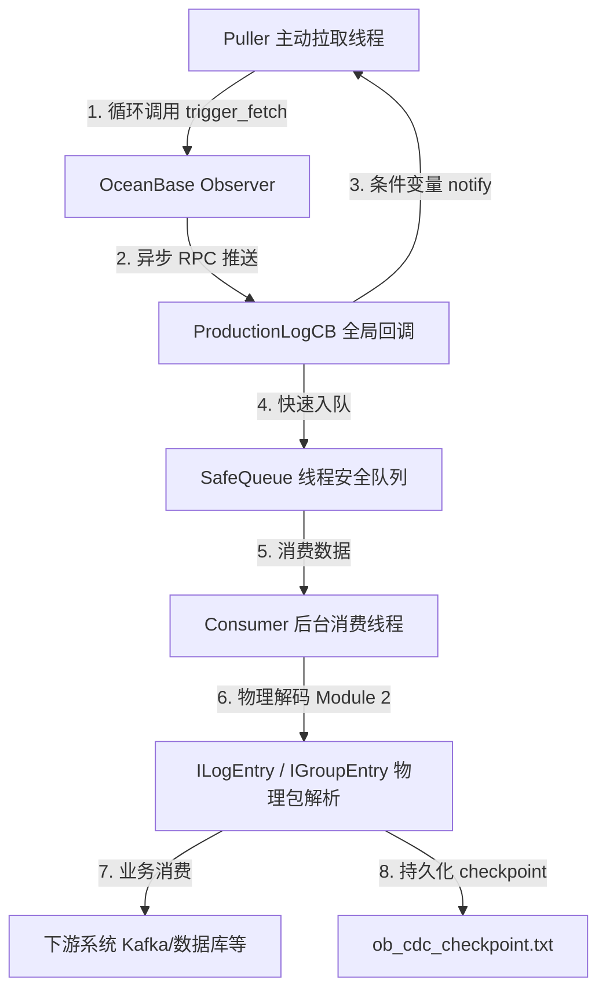

# OceanBase CDC 实时日志订阅生产级客户端方案

本项目提供了一个基于 OceanBase Database 的 C++ 变更数据捕获（CDC）组件 **libobcdc** 接口的高可用、高吞吐、生产级实时 Redo 日志订阅订阅端（CDC Client）。

---

## 1. 架构设计与核心组件

在生产环境下，为了确保日志订阅的高稳定性以及防止内存溢出（OOM），本方案采用**同步驱动异步**的双线程管道架构。



### 核心设计原则

1. **显式同步驱动拉取（Dedicated Pull Thread Loop）**
   * **设计**：设计独立的 `pull_worker_thread` 专属拉取线程，采用 `while(g_running)` 主动循环。
   * **原理**：调用异步 RPC 后，拉取线程使用条件变量 `g_rpc_cond` 进入阻塞等待。当异步回调成功或失败后，立刻解开锁并唤醒拉取线程。如果失败则退避重试，如果成功则推进 LSN 进度并立即发起下一轮 RPC。**这种同步驱动异步的模式彻底杜绝了网络假死导致的回调自闭环断裂，确保客户端会“死缠烂打”地一直调用 RPC 接口。**
2. **全局持久化回调生命周期（Zero-SIGSEGV Memory Design）**
   * **设计**：在全局空间中静态声明 `ProductionLogCB g_pull_cb;`，在异步 RPC 注册时一律传入此持久化对象。
   * **原理**：完全消除局部栈空间变量所带来的生命周期毁灭风险。网络 I/O 线程可以随时随地安全回调，从根源上彻底消灭了 `SIGSEGV`（段错误/内存越界）崩溃。
3. **物理日志二进制序列化（CLOG Parsing - Module 2）**
   * **设计**：在消费端调用 `IGroupEntry::deserialize` 与 `ILogEntry::deserialize`，在内存中原生地按照字节偏置完成物理事务解析，提取 LSN、SCN GTS 及 Row Image。
4. **断点续传与故障恢复（Checkpoint & Failover Recovery）**
   * **设计**：当消费线程成功将一批日志处理完毕并完成物理翻译后，会实时将当前批次最新的 LSN 进度写入本地的 `ob_cdc_checkpoint.txt`。程序在重启时会优先读取该文件进行断点续传。
5. **优雅停机（Graceful Shutdown）**
   * **设计**：捕获系统退出信号（`SIGINT` / `SIGTERM`），将原子变量 `g_running` 置为 `false`，安全唤醒并停止消费队列及拉取线程。消费线程会将队列中积压的存量日志处理完成，安全持久化最后一次 LSN 断点后，干净地退出。

---

## 2. 核心源码 (`main.cpp`)

以下是完整的生产级客户端代码实现，使用 C++17 标准编写：

```cpp
#include <iostream>
#include <map>
#include <chrono>
#include <string>
#include <unistd.h>
#include <thread>
#include <mutex>
#include <condition_variable>
#include <queue>
#include <atomic>
#include <csignal>
#include <fstream>
#include <new>
#include <algorithm>

#include "src/logservice/libobcdc/src/ob_log_rpc.h"
#include "src/logservice/libobcdc/src/ob_log_config.h"
#include "src/logservice/libobcdc/src/ob_log_trace_id.h"
#include "src/logservice/cdcservice/ob_cdc_req.h"
#include "share/ob_ls_id.h"

// 引入 OceanBase 物理 CLOG 核心解码头文件 (Module 2)
#include "logservice/ipalf/ipalf_log_group_entry.h"
#include "logservice/ipalf/ipalf_log_entry.h"

using namespace oceanbase;
using namespace oceanbase::libobcdc;
using namespace oceanbase::common;
using namespace oceanbase::ipalf;

// --- 生产级基础：原子控制与优雅退出信号 ---
std::atomic<bool> g_running(true);

// 优雅关机信号处理函数
void signal_handler(int signum) {
  std::cout << "\n[System] Received signal (" << signum << "). Initiating graceful shutdown..." << std::endl;
  g_running = false;
}

// --- 生产级同步控制原语：驱动 RPC 持续调用 ---
std::mutex g_rpc_mutex;
std::condition_variable g_rpc_cond;
std::atomic<bool> g_rpc_done(false);
std::atomic<bool> g_rpc_success(false);
std::atomic<uint64_t> g_next_lsn_val(0);
std::atomic<uint64_t> g_last_lsn(0);

// --- 生产级数据模型：日志任务包 ---
struct LogTask {
  palf::LSN lsn;
  std::string log_data;
  int64_t log_num;
  int64_t progress;
  share::ObLSID ls_id;
};

// --- 生产级设计 1：线程安全的高性能阻塞队列（含背压控制） ---
template <typename T>
class SafeQueue {
public:
  SafeQueue(size_t max_size) : max_size_(max_size), closed_(false) {}

  bool push(T &&item) {
    std::unique_lock<std::mutex> lock(mutex_);
    // 当队列满时，阻塞生产者线程实现“背压 (Backpressure)”控制，防止 OOM
    cond_push_.wait(lock, [this]() { return queue_.size() < max_size_ || closed_ || !g_running; });
    if (closed_ || !g_running) return false;
    queue_.push(std::move(item));
    cond_pop_.notify_one();
    return true;
  }

  bool pop(T &item, std::chrono::milliseconds timeout) {
    std::unique_lock<std::mutex> lock(mutex_);
    if (!cond_pop_.wait_for(lock, timeout, [this]() { return !queue_.empty() || closed_ || !g_running; })) {
      return false; // 等待超时
    }
    if (queue_.empty()) return false;
    item = std::move(queue_.front());
    queue_.pop();
    cond_push_.notify_one(); // 唤醒被阻塞的生产者
    return true;
  }

  void close() {
    std::unique_lock<std::mutex> lock(mutex_);
    closed_ = true;
    cond_pop_.notify_all();
    cond_push_.notify_all();
  }

  bool empty() const {
    std::lock_guard<std::mutex> lock(mutex_);
    return queue_.empty();
  }

  size_t size() const {
    std::lock_guard<std::mutex> lock(mutex_);
    return queue_.size();
  }

private:
  mutable std::mutex mutex_;
  std::queue<T> queue_;
  size_t max_size_;
  std::condition_variable cond_push_;
  std::condition_variable cond_pop_;
  bool closed_;
};

// 全局日志缓冲队列（背压大小限制为 1000 个 Batch）
SafeQueue<LogTask> g_log_queue(1000);

// --- 生产级设计 2：断点续传（持久化 Checkpoint） ---
const std::string CHECKPOINT_FILE = "ob_cdc_checkpoint.txt";

// 写入 LSN 断点到本地存储文件
void save_checkpoint(const palf::LSN &lsn) {
  std::ofstream fs(CHECKPOINT_FILE, std::ios::trunc);
  if (fs.is_open()) {
    fs << lsn.val_;
    fs.close();
  }
}

// 启动时加载历史 LSN 断点，实现故障恢复
bool load_checkpoint(palf::LSN &lsn) {
  std::ifstream fs(CHECKPOINT_FILE);
  if (fs.is_open()) {
    uint64_t val = 0;
    if (fs >> val) {
      lsn.val_ = val;
      fs.close();
      return true;
    }
    fs.close();
  }
  return false;
}

// Forward declaration of the Pull Manager
class LSPullManager;

// --- 生产级设计 3：高性能异步流回调处理器 ---
class ProductionLogCB : public obrpc::ObCdcProxy::AsyncCB<obrpc::OB_LS_FETCH_LOG2> {
  typedef obrpc::ObCdcProxy::AsyncCB<obrpc::OB_LS_FETCH_LOG2> RpcCBBase;

public:
  ProductionLogCB() {}

  // 必须实现 set_args 纯虚接口
  void set_args(const obrpc::ObCdcLSFetchLogReq &args) override {
    (void)args;
  }

  // 必须实现 clone，以便 Easy 网络框架内部复制和调度回调对象
  rpc::frame::ObReqTransport::AsyncCB *clone(const rpc::frame::SPAlloc &alloc) const override {
    void *buf = nullptr;
    ProductionLogCB *cb = nullptr;
    if (OB_ISNULL(buf = alloc(sizeof(ProductionLogCB)))) {
      std::cerr << "[RPC CB] clone failed due to memory allocation failure." << std::endl;
    } else {
      cb = new(buf) ProductionLogCB();
    }
    return cb;
  }

  // 接收包成功处理回调
  int process() override {
    obrpc::ObCdcLSFetchLogResp &result = RpcCBBase::result_;
    ObRpcResultCode &rcode = RpcCBBase::rcode_;

    // 1. 如果 RPC 成功或者 Observer 端正确返回
    if (rcode.rcode_ == OB_SUCCESS && result.get_err() == OB_SUCCESS) {
      uint64_t current_lsn_val = g_last_lsn.load();

      // 把收到的原始日志块快速扔进 SafeQueue（零阻塞回调线程，实现异步解耦）
      LogTask task;
      task.ls_id = share::ObLSID(1);
      task.lsn.val_ = current_lsn_val;
      task.log_num = result.get_log_num();
      task.progress = result.get_progress();
      if (task.log_num > 0 && result.get_log_entry_buf() != nullptr) {
        task.log_data.assign(result.get_log_entry_buf(), result.get_pos());
      }
      g_log_queue.push(std::move(task));

      // 提取最新的 next_req_lsn 用于唤醒后的下一轮调用
      palf::LSN next_lsn = result.get_next_req_lsn();
      g_next_lsn_val = next_lsn.is_valid() ? next_lsn.val_ : current_lsn_val;
      g_rpc_success = true;
    } else {
      std::cerr << "[RPC CB] Error in fetching logs: rcode=" << rcode.rcode_
                << ", biz_err=" << result.get_err() << std::endl;
      g_rpc_success = false;
    }

    // 2. 解锁同步信号量，通知主动拉取线程继续下一轮迭代
    {
      std::lock_guard<std::mutex> lock(g_rpc_mutex);
      g_rpc_done = true;
    }
    g_rpc_cond.notify_all();

    result.reset(); // 必须显式重置以释放响应对象占用的 RPC 序列化内存
    return OB_SUCCESS;
  }

  // 超时回调处理
  void on_timeout() override {
    std::cerr << "[RPC CB] Request timeout." << std::endl;
    g_rpc_success = false;
    {
      std::lock_guard<std::mutex> lock(g_rpc_mutex);
      g_rpc_done = true;
    }
    g_rpc_cond.notify_all();
  }

  // 包异常毁坏回调
  void on_invalid() override {
    std::cerr << "[RPC CB] Invalid response packet." << std::endl;
    g_rpc_success = false;
    {
      std::lock_guard<std::mutex> lock(g_rpc_mutex);
      g_rpc_done = true;
    }
    g_rpc_cond.notify_all();
  }
};

// 全局静态持久化回调对象，生命周期覆盖程序整个运行周期，彻底消灭 SIGSEGV 崩溃
ProductionLogCB g_pull_cb;

// 统一拉取调度管理器
class LSPullManager {
public:
  LSPullManager(ObLogRpc &rpc, uint64_t tenant_id, const ObAddr &svr, share::ObLSID ls_id)
      : rpc_(rpc), tenant_id_(tenant_id), svr_(svr), ls_id_(ls_id) {}

  void trigger_fetch(const palf::LSN &start_lsn);
  
  ObLogRpc &get_rpc() { return rpc_; }
  uint64_t get_tenant_id() const { return tenant_id_; }
  const ObAddr &get_svr() const { return svr_; }
  share::ObLSID get_ls_id() const { return ls_id_; }

private:
  ObLogRpc &rpc_;
  uint64_t tenant_id_;
  ObAddr svr_;
  share::ObLSID ls_id_;
};

// 调度拉取的具体实现
void LSPullManager::trigger_fetch(const palf::LSN &start_lsn) {
  if (!g_running) return;

  obrpc::ObCdcLSFetchLogReq req;
  req.set_ls_id(ls_id_);
  req.set_start_lsn(start_lsn);

  int64_t timeout_us = 5000000; // 5秒超时
  int ret = rpc_.async_stream_fetch_log(tenant_id_, svr_, req, g_pull_cb, timeout_us);
  if (ret != OB_SUCCESS) {
    std::cerr << "[Pull Manager] async_stream_fetch_log trigger fail, err: " << ret << std::endl;
    g_rpc_success = false;
    {
      std::lock_guard<std::mutex> lock(g_rpc_mutex);
      g_rpc_done = true;
    }
    g_rpc_cond.notify_all();
  }
}

// --- 生产级设计 4：后台高性能消费线程与物理 CLOG 解码模块 (Module 2) ---
void consumer_worker_thread() {
  std::cout << "[Consumer] Consumer worker thread started." << std::endl;
  LogTask task;
  
  while (g_running || !g_log_queue.empty()) {
    // 从安全队列中 Pop 任务，100ms 超时用于优雅检测系统退出信号
    if (g_log_queue.pop(task, std::chrono::milliseconds(100))) {
      
      // 1. 进行深度的物理 CLOG 二进制包解码与消费 (Module 2)
      if (task.log_num > 0 && !task.log_data.empty()) {
        std::cout << "[Consumer] [Success] Processing LSN: " << task.lsn.val_ 
                  << ", log_entries_count: " << task.log_num 
                  << ", bytes: " << task.log_data.size() << std::endl;
        
        const char *buf = task.log_data.data();
        const int64_t len = task.log_data.size();
        int64_t pos = 0;
        palf::LSN current_lsn = task.lsn;

        // 遍历这批数据中的每一个物理日志组 Entry (GroupEntry)
        for (int64_t idx = 0; idx < task.log_num; ++idx) {
          if (pos >= len) {
            std::cerr << "  [Parser] Error: pos exceeds log data len!" << std::endl;
            break;
          }

          // 实例化 OceanBase 的物理 GroupEntry 进行反序列化 (Module 2 解码)
          IGroupEntry group_entry(true /* enable_logservice */);
          int parse_ret = group_entry.deserialize(current_lsn, buf, len, pos);
          if (parse_ret != OB_SUCCESS) {
            std::cerr << "  [Parser] Failed to deserialize IGroupEntry, err=" << parse_ret 
                      << ", pos=" << pos << "/" << len << std::endl;
            break;
          }
          
          // 打印解析出的组日志基本元数据
          std::cout << "  [Parser] [GroupEntry " << idx << "] LSN: " << current_lsn.val_
                    << ", SCN_GTS: " << group_entry.get_scn().get_val_for_gts()
                    << ", DataLen: " << group_entry.get_data_len() << std::endl;

          const char *group_data_buf = group_entry.get_data_buf();
          int64_t group_data_len = group_entry.get_data_len();

          // 如果组日志中包含有效事务条目，则遍历并解析单个 ILogEntry
          if (group_data_len > 0 && group_data_buf != nullptr) {
            int64_t entry_pos = 0;
            int entry_idx = 0;
            while (entry_pos < group_data_len) {
              ILogEntry log_entry(true);
              int entry_ret = log_entry.deserialize(current_lsn, group_data_buf, group_data_len, entry_pos);
              if (entry_ret != OB_SUCCESS) {
                std::cerr << "    [Parser] Failed to deserialize ILogEntry, err=" << entry_ret << std::endl;
                break;
              }

              // 打印单个事务日志记录的长度与全局版本号
              std::cout << "    -> [LogEntry " << entry_idx++ << "] DataLen: " << log_entry.get_data_len()
                        << ", SCN_GTS: " << log_entry.get_scn().get_val_for_gts() << std::endl;
            }
          }

          // 递增当前 LSN，定位到下一个组日志的绝对物理偏移
          current_lsn.val_ += group_entry.get_group_entry_size(current_lsn);
        }
      } else {
        // 心跳包/空数据推进
        std::cout << "[Consumer] [Keep-Alive] Watermark advance. LSN: " << task.lsn.val_ << std::endl;
      }

      // 2. 消费完成后持久化 Checkpoint！故障重启后将由此恢复
      save_checkpoint(task.lsn);
    }
  }

  std::cout << "[Consumer] Consumer worker thread safely terminated." << std::endl;
}

// --- 生产级设计 5：专属 RPC 轮询驱动线程 (Dedicated RPC Puller Thread) ---
// 核心职责：在一个显式的、阻塞的主动循环中，以极强的高可用性百分之百确保持续不断地调用 RPC 接口
void pull_worker_thread(LSPullManager &manager, palf::LSN start_lsn) {
  std::cout << "[Puller] Dedicated RPC pull thread started." << std::endl;
  palf::LSN current_lsn = start_lsn;

  while (g_running) {
    // 重置本轮 RPC 同步原语状态
    g_rpc_done = false;
    g_rpc_success = false;

    // 主动发起一次 RPC 接口调用
    std::cout << "[Puller] Calling RPC async_stream_fetch_log for LSN: " << current_lsn.val_ << std::endl;
    manager.trigger_fetch(current_lsn);

    // 阻塞等待异步回调结果唤醒（收到包、超时、或网络失败）
    {
      std::unique_lock<std::mutex> lock(g_rpc_mutex);
      g_rpc_cond.wait(lock, []() { return g_rpc_done.load() || !g_running; });
    }

    if (!g_running) break;

    // 根据本轮 RPC 调用结果决定下一步动作
    if (g_rpc_success) {
      // 成功：递增并更新 LSN 进度
      current_lsn.val_ = g_next_lsn_val.load();
      g_last_lsn = current_lsn.val_;
    } else {
      // 失败/超时：退避 200 毫秒后，立刻再次调用 RPC 接口尝试重新建立流
      std::this_thread::sleep_for(std::chrono::milliseconds(200));
    }
  }
  std::cout << "[Puller] Dedicated RPC pull thread safely terminated." << std::endl;
}

// --- 主程序入口 ---
int main() {
  // 1. 注册核心优雅退出信号
  std::signal(SIGINT, signal_handler);
  std::signal(SIGTERM, signal_handler);

  int ret = OB_SUCCESS;

  std::cout << "[Main] Setting self address..." << std::endl;
  get_self_addr().set_ip_addr("127.0.0.1", static_cast<int32_t>(getpid()));

  std::cout << "[Main] Initializing ObLogConfig..." << std::endl;
  TCONF.init();
  std::map<std::string, std::string> configs;
  TCONF.load_from_map(configs);

  std::cout << "[Main] Initializing ObLogRpc..." << std::endl;
  ObLogRpc rpc;
  int64_t io_thread_num = 2; // 生产环境配置为 2 个 or 更多线程
  ret = rpc.init(io_thread_num);
  if (OB_SUCCESS != ret) {
    std::cerr << "[Main] ObLogRpc init failed, err: " << ret << std::endl;
    return ret;
  }
  std::cout << "[Main] ObLogRpc initialized successfully!" << std::endl;

  // 定位所需参数
  uint64_t tenant_id = 1002;
  ObAddr svr(ObAddr::IPV4, "127.0.0.1", 10001);
  share::ObLSID ls_id(1);

  palf::LSN start_lsn;
  bool has_checkpoint = load_checkpoint(start_lsn);

  if (has_checkpoint) {
    // 优先从历史断点恢复
    std::cout << "[Main] Found checkpoint! Resuming redo log stream from LSN: " << start_lsn.val_ << std::endl;
  } else {
    // 无历史断点，根据当前系统时间定位起始 LSN（含启动重试机制）
    std::cout << "[Main] No checkpoint found. Locating start LSN by system time..." << std::endl;
    
    obrpc::ObCdcReqStartLSNByTsReq req;
    obrpc::ObCdcReqStartLSNByTsReq::LocateParam param;
    param.ls_id_ = ls_id;
    
    auto now = std::chrono::system_clock::now();
    int64_t now_ns = std::chrono::duration_cast<std::chrono::nanoseconds>(now.time_since_epoch()).count();
    param.start_ts_ns_ = now_ns;
    req.append_param(param);

    obrpc::ObCdcReqStartLSNByTsResp resp;
    int64_t timeout = 5000000;

    // 生产级优势：循环不断重试连接定位，直到 Observer 启动并连通
    while (g_running) {
      ret = rpc.req_start_lsn_by_tstamp(tenant_id, svr, req, resp, timeout);
      if (OB_SUCCESS == ret && resp.get_results().count() > 0) {
        start_lsn = resp.get_results().at(0).start_lsn_;
        std::cout << "[Main] Successfully located start LSN: " << start_lsn.val_ << std::endl;
        break;
      } else {
        std::cerr << "[Main] Failed to locate start LSN (err=" << ret << "). Retrying in 3 seconds..." << std::endl;
        std::this_thread::sleep_for(std::chrono::seconds(3));
      }
    }
  }

  // 初始化全局活动变量
  g_last_lsn = start_lsn.val_;

  // 2. 启动后台消费者线程
  std::thread consumer_thread(consumer_worker_thread);

  // 3. 实例化拉取管理器
  LSPullManager pull_manager(rpc, tenant_id, svr, ls_id);
  
  // 4. 启动【拉取驱动线程】，开启强健的显式循环 RPC 调用
  std::thread pull_thread(pull_worker_thread, std::ref(pull_manager), start_lsn);

  // 5. 守护主线程，等待退出信号
  while (g_running) {
    std::this_thread::sleep_for(std::chrono::milliseconds(500));
  }

  // --- 6. 生产级优雅关闭链条 ---
  std::cout << "[Main] Stopping RPC and clearing queues..." << std::endl;
  g_log_queue.close(); // 唤醒并关闭消费队列，使消费者停止

  if (pull_thread.joinable()) {
    {
      std::lock_guard<std::mutex> lock(g_rpc_mutex);
      g_rpc_done = true; // 唤醒阻塞中的 puller 线程使其退出
    }
    g_rpc_cond.notify_all();
    pull_thread.join();
  }

  if (consumer_thread.joinable()) {
    consumer_thread.join(); // 等待所有正在消费的数据安全处理并持久化 checkpoint
  }

  rpc.destroy(); // 销毁 RPC 服务，断开与 Observer 的网络连接
  std::cout << "[Main] ObLogRpc destroyed. System shutdown complete." << std::endl;

  return 0;
}
