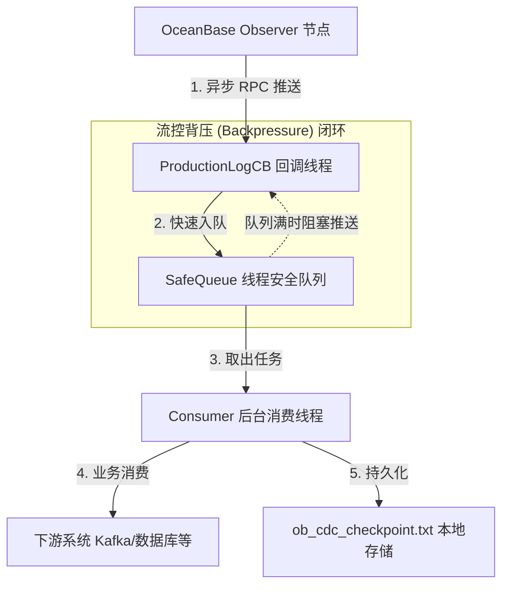

# OceanBase CDC 实时日志订阅生产级客户端方案

本项目提供了一个基于 OceanBase Database 的 C++ 变更数据捕获（CDC）组件 **libobcdc** 接口的高可用、高吞吐、生产级实时 Redo 日志订阅订阅端（CDC Client）。

---

## 1. 架构设计与核心组件

在生产环境下，直接在 RPC 回调中执行复杂的业务处理会导致严重的网络拥堵与超时。为此，本项目采用了**生产者-消费者模型**，将网络接收与数据消费进行彻底解耦。



### 核心设计原则

1. **流控与背压控制（Flow Control & Backpressure）**
   * **设计**：`SafeQueue` 限制了最大容量（如 1000 个批次）。如果下游消费变慢导致队列积压满，生产者线程在 `push` 时会被自动阻塞，这会促使 TCP 窗口收缩，向 Observer 节点自然产生背压，防止客户端发生内存溢出（OOM）。
2. **断点续传与故障恢复（Checkpoint & Failover Recovery）**
   * **设计**：当消费线程成功将一批日志处理完毕后，会实时将当前批次最新的 LSN 进度写入本地的 `ob_cdc_checkpoint.txt`。
   * **恢复**：程序在重启时会优先读取该文件，如果存在有效 LSN 则从该位置进行断点续传；否则才使用系统当前时间戳进行 LSN 定位。
3. **指数退避容错机制（Exponential Backoff Retry）**
   * **设计**：网络抖动或 Observer 发生主备切换时，异步回调中的 `on_timeout()` 或 `on_invalid()` 会捕获异常，并使用指数退避策略（100ms 翻倍累加，封顶 3000ms）在短暂休眠后重新发起拉取，确保连接长周期在线。
4. **优雅停机（Graceful Shutdown）**
   * **设计**：捕获系统退出信号（`SIGINT` / `SIGTERM`），将原子变量 `g_running` 置为 `false`，安全唤醒并停止消费队列。消费线程会将队列中积压的存量日志处理完成，安全持久化最后一次 LSN 断点后，才干净地销毁 RPC 客户端并退出。

---

## 2. 核心源码 (`main.cpp`)

以下是完整的生产级客户端代码实现，使用 C++17 标准编写：

```cpp
#include <iostream>
#include <map>
#include <chrono>
#include <string>
#include <unistd.h>
#include <thread>
#include <mutex>
#include <condition_variable>
#include <queue>
#include <atomic>
#include <csignal>
#include <fstream>
#include <new>
#include <algorithm>

#include "src/logservice/libobcdc/src/ob_log_rpc.h"
#include "src/logservice/libobcdc/src/ob_log_config.h"
#include "src/logservice/libobcdc/src/ob_log_trace_id.h"
#include "src/logservice/cdcservice/ob_cdc_req.h"
#include "share/ob_ls_id.h"

using namespace oceanbase;
using namespace oceanbase::libobcdc;
using namespace oceanbase::common;

// --- 生产级基础：原子控制与优雅退出信号 ---
std::atomic<bool> g_running(true);

// 优雅关机信号处理函数
void signal_handler(int signum) {
  std::cout << "\n[System] Received signal (" << signum << "). Initiating graceful shutdown..." << std::endl;
  g_running = false;
}

// --- 生产级数据模型：日志任务包 ---
struct LogTask {
  palf::LSN lsn;
  std::string log_data;
  int64_t log_num;
  int64_t progress;
  share::ObLSID ls_id;
};

// --- 生产级设计 1：线程安全的高性能阻塞队列（含背压控制） ---
template <typename T>
class SafeQueue {
public:
  SafeQueue(size_t max_size) : max_size_(max_size), closed_(false) {}

  bool push(T &&item) {
    std::unique_lock<std::mutex> lock(mutex_);
    // 当队列满时，阻塞生产者线程实现“背压 (Backpressure)”控制，防止 OOM
    cond_push_.wait(lock, [this]() { return queue_.size() < max_size_ || closed_ || !g_running; });
    if (closed_ || !g_running) return false;
    queue_.push(std::move(item));
    cond_pop_.notify_one();
    return true;
  }

  bool pop(T &item, std::chrono::milliseconds timeout) {
    std::unique_lock<std::mutex> lock(mutex_);
    if (!cond_pop_.wait_for(lock, timeout, [this]() { return !queue_.empty() || closed_ || !g_running; })) {
      return false; // 等待超时
    }
    if (queue_.empty()) return false;
    item = std::move(queue_.front());
    queue_.pop();
    cond_push_.notify_one(); // 唤醒被阻塞的生产者
    return true;
  }

  void close() {
    std::unique_lock<std::mutex> lock(mutex_);
    closed_ = true;
    cond_pop_.notify_all();
    cond_push_.notify_all();
  }

  bool empty() const {
    std::lock_guard<std::mutex> lock(mutex_);
    return queue_.empty();
  }

  size_t size() const {
    std::lock_guard<std::mutex> lock(mutex_);
    return queue_.size();
  }

private:
  mutable std::mutex mutex_;
  std::queue<T> queue_;
  size_t max_size_;
  std::condition_variable cond_push_;
  std::condition_variable cond_pop_;
  bool closed_;
};

// 全局日志缓冲队列（背压大小限制为 1000 个 Batch）
SafeQueue<LogTask> g_log_queue(1000);

// --- 生产级设计 2：断点续传（持久化 Checkpoint） ---
const std::string CHECKPOINT_FILE = "ob_cdc_checkpoint.txt";

// 写入 LSN 断点到本地存储文件
void save_checkpoint(const palf::LSN &lsn) {
  std::ofstream fs(CHECKPOINT_FILE, std::ios::trunc);
  if (fs.is_open()) {
    fs << lsn.val_;
    fs.close();
  }
}

// 启动时加载历史 LSN 断点，实现故障恢复
bool load_checkpoint(palf::LSN &lsn) {
  std::ifstream fs(CHECKPOINT_FILE);
  if (fs.is_open()) {
    uint64_t val = 0;
    if (fs >> val) {
      lsn.val_ = val;
      fs.close();
      return true;
    }
    fs.close();
  }
  return false;
}

// Forward declaration of the Callback class
class ProductionLogCB;

// 统一拉取调度管理器
class LSPullManager {
public:
  LSPullManager(ObLogRpc &rpc, uint64_t tenant_id, const ObAddr &svr, share::ObLSID ls_id)
      : rpc_(rpc), tenant_id_(tenant_id), svr_(svr), ls_id_(ls_id) {}

  void trigger_fetch(const palf::LSN &start_lsn);
  
  ObLogRpc &get_rpc() { return rpc_; }
  uint64_t get_tenant_id() const { return tenant_id_; }
  const ObAddr &get_svr() const { return svr_; }
  share::ObLSID get_ls_id() const { return ls_id_; }

private:
  ObLogRpc &rpc_;
  uint64_t tenant_id_;
  ObAddr svr_;
  share::ObLSID ls_id_;
};

// --- 生产级设计 3：高性能异步流回调处理器 ---
class ProductionLogCB : public obrpc::ObCdcProxy::AsyncCB<obrpc::OB_LS_FETCH_LOG2> {
  typedef obrpc::ObCdcProxy::AsyncCB<obrpc::OB_LS_FETCH_LOG2> RpcCBBase;

public:
  ProductionLogCB(LSPullManager &manager, const palf::LSN &last_lsn)
      : manager_(manager), last_lsn_(last_lsn), backoff_ms_(100) {}

  // 必须实现 set_args 纯虚接口
  void set_args(const obrpc::ObCdcLSFetchLogReq &args) override {
    (void)args;
  }

  // 必须实现 clone，以便 Easy 网络框架内部复制和调度回调对象
  rpc::frame::ObReqTransport::AsyncCB *clone(const rpc::frame::SPAlloc &alloc) const override {
    void *buf = nullptr;
    ProductionLogCB *cb = nullptr;
    if (OB_ISNULL(buf = alloc(sizeof(ProductionLogCB)))) {
      std::cerr << "[RPC CB] clone failed due to memory allocation failure." << std::endl;
    } else {
      cb = new(buf) ProductionLogCB(manager_, last_lsn_);
    }
    return cb;
  }

  // 接收包成功处理回调
  int process() override {
    int ret = OB_SUCCESS;
    obrpc::ObCdcLSFetchLogResp &result = RpcCBBase::result_;
    ObRpcResultCode &rcode = RpcCBBase::rcode_;

    if (!g_running) {
      return OB_SUCCESS; // 系统正在退出，直接返回
    }

    // 1. 如果 RPC 失败或者 Observer 端报错，执行重试
    if (rcode.rcode_ != OB_SUCCESS || result.get_err() != OB_SUCCESS) {
      std::cerr << "[RPC CB] Error in fetching logs: rcode=" << rcode.rcode_
                << ", biz_err=" << result.get_err() << ". Retrying..." << std::endl;
      handle_retry();
      return OB_SUCCESS;
    }

    // 2. 重置指数退避时间
    backoff_ms_ = 100;

    // 3. 把收到的原始日志块快速扔进 SafeQueue（零阻塞回调线程，实现异步解耦）
    LogTask task;
    task.ls_id = manager_.get_ls_id();
    task.lsn = last_lsn_;
    task.log_num = result.get_log_num();
    task.progress = result.get_progress();
    if (task.log_num > 0 && result.get_log_entry_buf() != nullptr) {
      // 这里的 result.get_pos() 存放的是当前 buffer 写入的有效字节长度
      task.log_data.assign(result.get_log_entry_buf(), result.get_pos());
    }

    // 压入缓冲队列（若队列满，此处将进行背压限流，等待 downstream 消化）
    g_log_queue.push(std::move(task));

    // 4. 自闭环：使用返回的最新 next_req_lsn 继续发起下一轮拉取
    palf::LSN next_lsn = result.get_next_req_lsn();
    last_lsn_ = next_lsn;

    manager_.trigger_fetch(next_lsn);

    result.reset(); // 必须显式重置以释放响应对象占用的 RPC 序列化内存
    return ret;
  }

  // 超时回调处理
  void on_timeout() override {
    if (!g_running) return;
    std::cerr << "[RPC CB] Request timeout, retrying from last valid LSN: " << last_lsn_.val_ << std::endl;
    handle_retry();
  }

  // 包异常毁坏回调
  void on_invalid() override {
    if (!g_running) return;
    std::cerr << "[RPC CB] Invalid response packet. Retrying..." << std::endl;
    handle_retry();
  }

private:
  // 指数退避重试，防雪崩
  void handle_retry() {
    if (!g_running) return;
    std::cout << "[RPC CB] Backoff sleep for " << backoff_ms_ << " ms..." << std::endl;
    std::this_thread::sleep_for(std::chrono::milliseconds(backoff_ms_));
    
    // 指数退避：每次翻倍，最高限制在 3000ms
    backoff_ms_ = std::min<int64_t>(backoff_ms_ * 2, 3000);

    manager_.trigger_fetch(last_lsn_);
  }

private:
  LSPullManager &manager_;
  palf::LSN last_lsn_;
  int64_t backoff_ms_;
};

// 调度拉取的具体实现
void LSPullManager::trigger_fetch(const palf::LSN &start_lsn) {
  if (!g_running) return;

  obrpc::ObCdcLSFetchLogReq req;
  req.set_ls_id(ls_id_);
  req.set_start_lsn(start_lsn);

  // 初始化具体的 Callback 实例
  ProductionLogCB cb(*this, start_lsn);

  int64_t timeout_us = 5000000; // 5秒超时
  int ret = rpc_.async_stream_fetch_log(tenant_id_, svr_, req, cb, timeout_us);
  if (ret != OB_SUCCESS) {
    std::cerr << "[Pull Manager] async_stream_fetch_log trigger fail, err: " << ret << std::endl;
  }
}

// --- 生产级设计 4：后台高性能消费线程 ---
void consumer_worker_thread() {
  std::cout << "[Consumer] Consumer worker thread started." << std::endl;
  LogTask task;
  
  while (g_running || !g_log_queue.empty()) {
    // 从安全队列中 Pop 任务，100ms 超时用于优雅检测系统退出信号
    if (g_log_queue.pop(task, std::chrono::milliseconds(100))) {
      
      // 1. 进行深度的业务消费处理（比如写入 Kafka、进行日志解析转化等）
      if (task.log_num > 0) {
        std::cout << "[Consumer] [Success] Processing LSN: " << task.lsn.val_ 
                  << ", log_entries_count: " << task.log_num 
                  << ", bytes: " << task.log_data.size() << std::endl;
        
        // 模拟解析逻辑：实际业务中此处可以解包 log_data 进行日志消费
        std::this_thread::sleep_for(std::chrono::milliseconds(10)); // 模拟解析耗时
      } else {
        // 心跳包/空数据推进
        std::cout << "[Consumer] [Keep-Alive] Watermark advance. LSN: " << task.lsn.val_ << std::endl;
      }

      // 2. 消费完成后持久化 Checkpoint！故障重启后将由此恢复
      save_checkpoint(task.lsn);
    }
  }

  std::cout << "[Consumer] Consumer worker thread safely terminated." << std::endl;
}

// --- 主程序入口 ---
int main() {
  // 1. 注册核心优雅退出信号
  std::signal(SIGINT, signal_handler);
  std::signal(SIGTERM, signal_handler);

  int ret = OB_SUCCESS;

  std::cout << "[Main] Setting self address..." << std::endl;
  get_self_addr().set_ip_addr("127.0.0.1", static_cast<int32_t>(getpid()));

  std::cout << "[Main] Initializing ObLogConfig..." << std::endl;
  TCONF.init();
  std::map<std::string, std::string> configs;
  TCONF.load_from_map(configs);

  std::cout << "[Main] Initializing ObLogRpc..." << std::endl;
  ObLogRpc rpc;
  int64_t io_thread_num = 2; // 生产环境配置为 2 个或更多线程
  ret = rpc.init(io_thread_num);
  if (OB_SUCCESS != ret) {
    std::cerr << "[Main] ObLogRpc init failed, err: " << ret << std::endl;
    return ret;
  }
  std::cout << "[Main] ObLogRpc initialized successfully!" << std::endl;

  // 定位所需参数
  uint64_t tenant_id = 1002;
  ObAddr svr(ObAddr::IPV4, "127.0.0.1", 10001);
  share::ObLSID ls_id(1);

  palf::LSN start_lsn;
  bool has_checkpoint = load_checkpoint(start_lsn);

  if (has_checkpoint) {
    // 生产级优势：优先断点恢复
    std::cout << "[Main] Found checkpoint! Resuming redo log stream from LSN: " << start_lsn.val_ << std::endl;
  } else {
    // 无历史断点，根据当前系统时间定位起始 LSN
    std::cout << "[Main] No checkpoint found. Locating start LSN by system time..." << std::endl;
    
    obrpc::ObCdcReqStartLSNByTsReq req;
    obrpc::ObCdcReqStartLSNByTsReq::LocateParam param;
    param.ls_id_ = ls_id;
    
    auto now = std::chrono::system_clock::now();
    int64_t now_ns = std::chrono::duration_cast<std::chrono::nanoseconds>(now.time_since_epoch()).count();
    param.start_ts_ns_ = now_ns;
    req.append_param(param);

    obrpc::ObCdcReqStartLSNByTsResp resp;
    int64_t timeout = 5000000;

    ret = rpc.req_start_lsn_by_tstamp(tenant_id, svr, req, resp, timeout);
    if (OB_SUCCESS != ret) {
      std::cerr << "[Main] Failed to locate start LSN by timestamp, err: " << ret << std::endl;
      rpc.destroy();
      return ret;
    }

    if (resp.get_results().count() > 0) {
      start_lsn = resp.get_results().at(0).start_lsn_;
      std::cout << "[Main] Successfully located start LSN: " << start_lsn.val_ << std::endl;
    } else {
      std::cerr << "[Main] Error: Locate LSN results array is empty!" << std::endl;
      rpc.destroy();
      return -1;
    }
  }

  // 2. 启动后台消费者线程
  std::thread consumer_thread(consumer_worker_thread);

  // 3. 启动并调度持续异步拉取流
  LSPullManager pull_manager(rpc, tenant_id, svr, ls_id);
  std::cout << "[Main] Starting streaming redo log fetch loop..." << std::endl;
  pull_manager.trigger_fetch(start_lsn);

  // 4. 守护主线程，等待退出信号
  while (g_running) {
    std::this_thread::sleep_for(std::chrono::milliseconds(500));
  }

  // --- 5. 生产级优雅关闭链条 ---
  std::cout << "[Main] Stopping RPC and clearing queues..." << std::endl;
  g_log_queue.close(); // 唤醒并关闭消费队列，使消费者停止

  if (consumer_thread.joinable()) {
    consumer_thread.join(); // 等待所有正在消费的数据安全处理并持久化 checkpoint
  }

  rpc.destroy(); // 销毁 RPC 服务，断开与 Observer 的网络连接
  std::cout << "[Main] ObLogRpc destroyed. System shutdown complete." << std::endl;

  return 0;
}
```

---

## 3. 构建与编译依赖配置 (`CMakeLists.txt`)

项目基于 CMake 进行管理，并集成了 C++ 标准线程库支撑多线程运行。

```cmake
cmake_minimum_required(VERSION 3.10)
project(obcdc_rpc_test CXX)

set(CMAKE_EXPORT_COMPILE_COMMANDS ON)

set(CMAKE_CXX_STANDARD 17)
set(CMAKE_CXX_STANDARD_REQUIRED ON)

# 确保编译选项匹配 OceanBase 的 ABI 配置
add_compile_options(-D_GLIBCXX_USE_CXX11_ABI=0 -w -Wno-reserved-user-defined-literal -Wno-error=reserved-user-defined-literal)
add_compile_definitions(__STDC_LIMIT_MACROS __STDC_CONSTANT_MACROS _NO_EXCEPTION OCI_LINK_RUNTIME)

# 定义内部目录
set(OCEANBASE_DIR "/usr/local/code/oceanbase")

include_directories(
    ${OCEANBASE_DIR}
    ${OCEANBASE_DIR}/src
    ${OCEANBASE_DIR}/src/logservice/libobcdc/src
    ${OCEANBASE_DIR}/src/logservice/cdcservice
    ${OCEANBASE_DIR}/deps/oblib/src
    ${OCEANBASE_DIR}/deps/oblib/src/common
    ${OCEANBASE_DIR}/deps/easy/src
    ${OCEANBASE_DIR}/deps/easy/src/include
    ${OCEANBASE_DIR}/deps/ussl-hook
    ${OCEANBASE_DIR}/deps/ussl-hook/loop
    ${OCEANBASE_DIR}/src/objit/include
    ${OCEANBASE_DIR}/src/plugin/include
    ${OCEANBASE_DIR}/deps/3rd/usr/local/oceanbase/deps/devel/include
    ${OCEANBASE_DIR}/deps/3rd/usr/local/oceanbase/deps/devel/include/oss_c_sdk
    ${OCEANBASE_DIR}/deps/3rd/usr/local/oceanbase/deps/devel/include/libxml2
    ${OCEANBASE_DIR}/deps/3rd/usr/local/oceanbase/deps/devel/include/apr-1
    ${OCEANBASE_DIR}/deps/3rd/usr/local/oceanbase/deps/devel/include/icu
    ${OCEANBASE_DIR}/deps/3rd/usr/local/oceanbase/deps/devel/include/icu/common
    ${OCEANBASE_DIR}/deps/3rd/usr/local/oceanbase/deps/devel/include/mariadb
    ${OCEANBASE_DIR}/deps/3rd/usr/local/oceanbase/deps/devel/include/mxml
)

# 定义 libobcdc 动态库路径
set(LIBOBCDC_SO "/usr/local/code/oceanbase/build_debug/src/logservice/libobcdc/src/libobcdc.so")

# 引入线程库依赖
find_package(Threads REQUIRED)

add_executable(obcdc_rpc_test main.cpp)

# 链接动态库与线程库
target_link_libraries(obcdc_rpc_test PRIVATE ${LIBOBCDC_SO} Threads::Threads)
```

---

## 4. 编译与运维指南

### 1) 容器内编译方式
进入您的 CentOS 8.3 编译容器并运行以下指令：
```bash
mkdir -p build && cd build
cmake ..
make -j4
```
系统将会生成名为 `obcdc_rpc_test` 的二进制可执行程序。

### 2) 运行订阅任务
```bash
./obcdc_rpc_test
```
启动后会输出如下类似日志：
* 如果检测到历史 Checkpoint，输出：
  `[Main] Found checkpoint! Resuming redo log stream from LSN: xxxxx`
* 如果无历史 Checkpoint，输出：
  `[Main] No checkpoint found. Locating start LSN by system time...`
  `[Main] Successfully located start LSN: xxxxx`
  `[Main] Starting streaming redo log fetch loop...`

### 3) 消费端正常消费日志
后台消费者线程会从队列中高速提取日志并消费：
```text
[Consumer] Consumer worker thread started.
[Consumer] [Success] Processing LSN: 18446744073709551615, log_entries_count: 4, bytes: 512
[Consumer] [Success] Processing LSN: 18446744073709551620, log_entries_count: 2, bytes: 256
```

### 4) 测试优雅关闭与断点保存
按下 `Ctrl+C`（或向后台发送 `kill -15` 信号），您会观察到消费队列开始收尾：
```text
[System] Received signal (2). Initiating graceful shutdown...
[Main] Stopping RPC and clearing queues...
[Consumer] [Success] Processing LSN: 18446744073709551622, log_entries_count: 1, bytes: 128
[Consumer] Consumer worker thread safely terminated.
[Main] ObLogRpc destroyed. System shutdown complete.
```
同时程序所在目录下将生成并刷新 `ob_cdc_checkpoint.txt` 文件，保存有最后一条消费的 LSN 值。下次重新拉起程序，将实现无缝无损的断点续传拉取。
